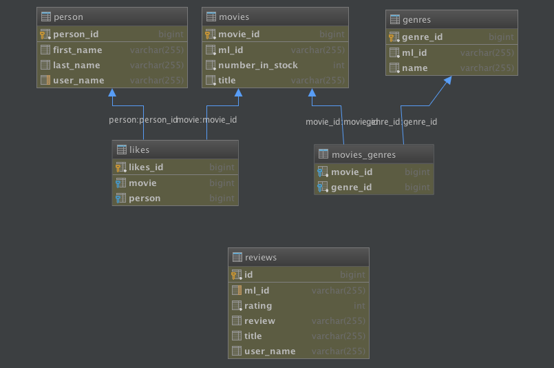

:compat-mode:
= Lab  - Identify the bounded contexts of the Monolith App

In this lab we'll identify the bounded contexts so that they can be easily extracted into microservices. 

== Data decomposition

. Look at the domain model and identify it can be split up. 
+
 
+
